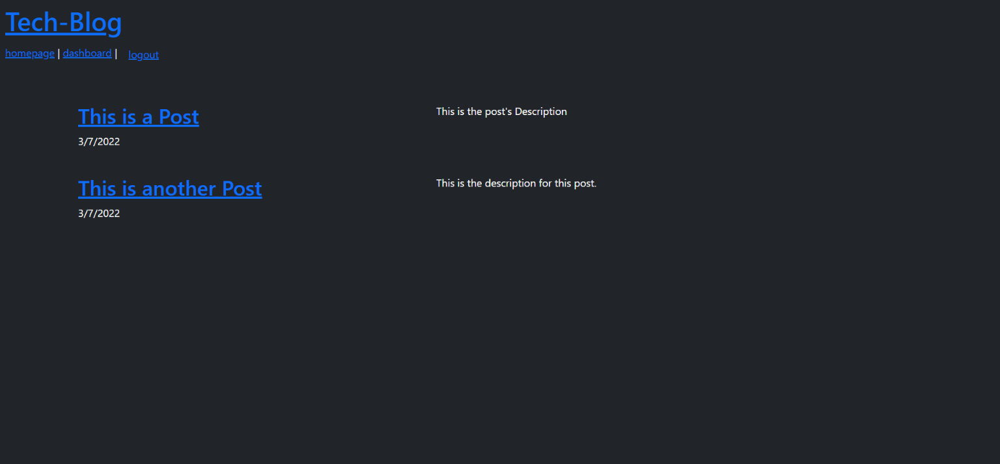
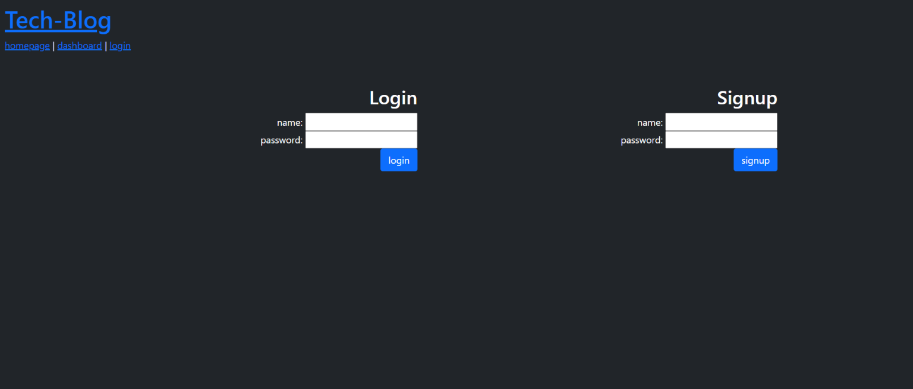
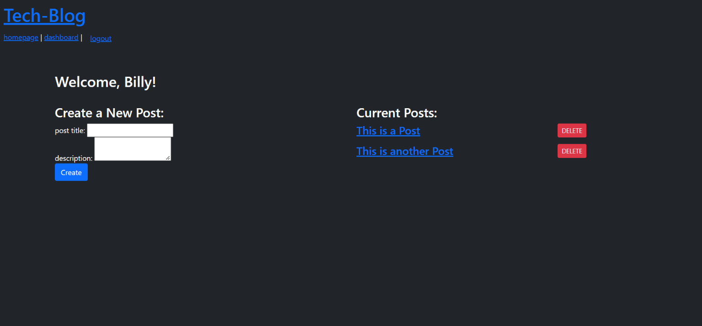

# Tech-Blog

A CMS-style blog site where a user can publish articles, blog posts, and any thoughts and opinions. This is just a simple Tech Blog with the ability to create an account, make posts from that account, view other posts, and soon to be added, the abbility to comment on posts.

The only pages that can be viewed before an account is made are the homepage and of course the login/singup page. If any other link is clicked the user will be redirected to the login page to either create an account or login.

The styling could definately use some work.

Live Application: https://boring-ol-tech-blog.herokuapp.com/

My Repository: https://github.com/Billygm/Tech-Blog

